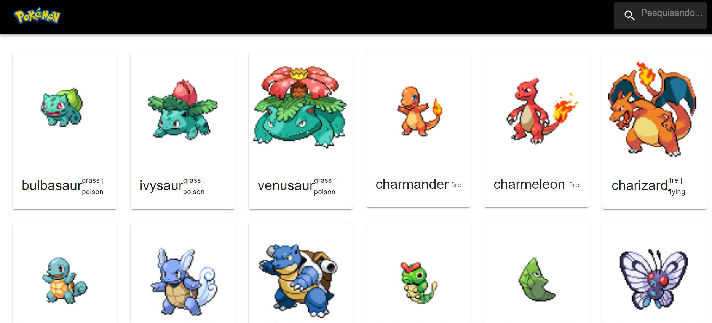

# Projeto Hospedado: https://react-js-api-rouge.vercel.app/



# Pokedex - Projeto com React.js e PokeAPI

Este é um projeto de Pokedex simples criado com React.js, onde você pode explorar informações sobre os Pokémon usando a [PokeAPI](https://pokeapi.co/). Utilizamos o hook `useState` para gerenciar o estado do aplicativo.

## Tecnologias Usadas

- **React.js:** Uma biblioteca JavaScript popular para a criação de interfaces de usuário interativas e componentes reutilizáveis.
- **MUI MAterial** Usado Para estilização

## Funcionalidades

- **Lista de Pokémon:** Exibe uma lista de Pokémon da PokeAPI.
- **Detalhes do Pokémon:** Permite visualizar detalhes de um Pokémon selecionado, como nome, tipo, habilidades e imagem.
- **Pesquisa de Pokémon:** Permite pesquisar Pokémon por nome.

## Como Executar o Projeto

Siga estas etapas para executar o projeto em seu ambiente local:

1. **Clonar o Repositório:**
   ```bash
   git clone https://github.com/CaykMagnani/ReactJS-API.git
   cd ReactJS-API

2. **Instalar Dependencias:**
    npm install
    npm install @mui/material @emotion/react @emotion/styled
    npm install react-router-dom
    npm install @mui/icons-material @mui/material @emotion/styled @emotion/react

3. **Iniciar**
    npm start

4. **Acessar**
    Abra seu navegador e visite http://localhost:3000 para visualizar o aplicativo.